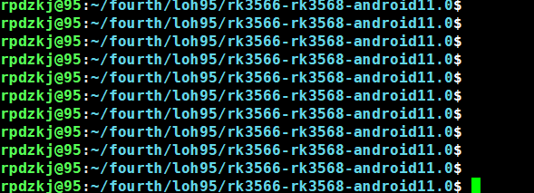
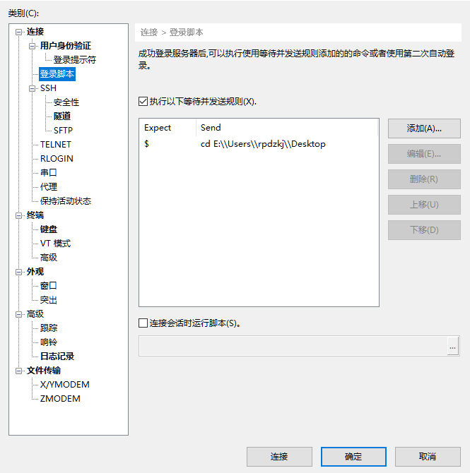

# 高亮字符
%%
## 启动信息
~~~regex
(\b(last (failed )?login:|launching|checking|loading|creating|building|important|booting|starting|notice|informational|informationen|informazioni|informação|oplysninger|informations?|info|información|informasi|note|iiii|)\b)
~~~
## prompt 高亮
~~~regex
^[\[a-zA-Z0-9-]+(.[a-zA-Z0-9@\/\]\ ~:-]+)*(\$|#)
~~~

~~~Regex
^[^/#-\ ]\S\s?\S+\s?\S*(\$ |# )
^[^/#-\ ]\S\s?\S+\s?\S*(?=\$ |# )
(?<=^[^/#-\ ]\S\s?\S+\s?\S*)(\$ |# ) # 返回最后一个$或者#
~~~
%%

### 示例


````ad-info
title: 目前使用

```regex
# prompt 颜色
^[^/#-\ ]\S\s?\S+(?=((:|])\S*\s?\S*(\$|#)\s{1}))

# 路径颜色
(?<=(^[^/#-\ ]\S{0,8}\s?\S{0,8}:))\S*\s?\S*(?=(\$|#)\s{1})

# $ or # white color 
(?<=(^[^/#-\ ]\S\s?\S+:\S*\s?\S*))(\$|#)\s{1}
```
````

### 字体设置

### 失败信息高亮
~~~regex
failed|fail|fatal
~~~
## 服务器提示符设置
~~~shell
PS1="\[\e]0;\u@\h: \w\a\]${debian_chroot:+($debian_chroot)}\[\033[01;32m\]\u@\h\[\033[00m\]:\[\033[01;34m\]\w\[\033[00m\]\r\n\$ "
~~~

# 打开本地 shell 到指定目录
~~~shell
cd E:\\Users\\rpdzkj\\Desktop
~~~


## xshell 窗口备份


```shell
clear;PS1="\[\e]0;\u@\h: \w\a\]${debian_chroot:+($debian_chroot)}\[\033[01;32m\]\u@\h\[\033[00m\]:\[\033[01;34m\]\w\[\033[00m\]\r\n\$ ";cd ~/fourth/loh95/;ls
```

```shell
PS1='${debian_chroot:+($debian_chroot)}\[\033[01;32m\]\u@\h\[\033[00m\]:\[\033[01;34m\]\w\[\033[00m\]\$ '
```


# Link
* 下载网址： [Free for Home/School - Xshell and Xftp Free Licensing](https://www.netsarang.com/en/free-for-home-school/)