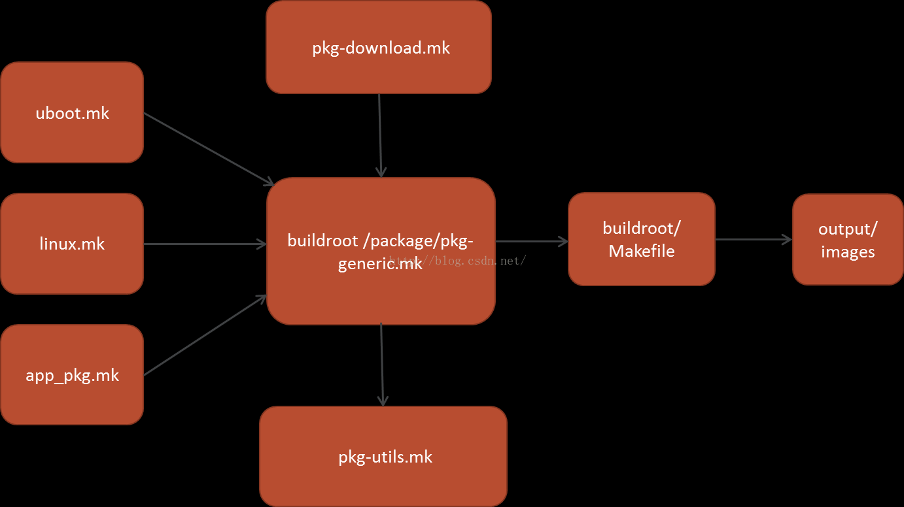

# buildroot fs-overlay
默认编译出来根文件系统，有些配置文件可能不能满足客制化需求，这时候 fs-overlay 就能排上用场，fs-overlay 目录会在编译的最后阶段替换到文件系统目录，打包进根文件系统。 fs-overlay 路径由默认配置文件指定：
```shell
BR2_ROOTFS_OVERLAY="board/rockchip/rk3308/fs-overlay"
```

## buildroot 框架
1. Buildroot 提供了函数框架和变量命令框架，采用它的框架编写的**app_pkg. mk**这种 Makefile 格式的**自动构建脚本**，将被**package/pkg-generic. mk 这个核心脚本**展开填充到 buildroot 主目录下的 Makefile 中去。
2. make all 执行 Buildroot 主目录下的 Makefile，生成你想要的 image。 package/pkg-generic. mk 中通过调用同目录下的 pkg-download. mk、pkg-utils. mk 文件，已经帮你自动实现了下载、解压、依赖包下载编译等一系列机械化的流程。
3. 按照格式写 app_pkg. mk，填充下载地址，链接依赖库的名字等一些特有的构建细节即可。总而言之，Buildroot 本身提供构建流程的框架，开发者按照格式写脚本，提供必要的构建细节，配置整个系统，最后自动构建出你的系统。Buildroot 提供了函数框架和变量命令框架，采用它的框架编写的**app_pkg. mk**这种 Makefile 格式的**自动构建脚本**，将被**package/pkg-generic. mk 这个核心脚本**展开填充到 buildroot 主目录下的 Makefile 中去。最后 make all 执行 Buildroot 主目录下的 Makefile，生成你想要的 image。 package/pkg-generic. mk 中通过调用同目录下的 pkg-download. mk、pkg-utils. mk 文件，已经帮你自动实现了下载、解压、依赖包下载编译等一系列机械化的流程。你只要需要按照格式写 app_pkg. mk，填充下载地址，链接依赖库的名字等一些特有的构建细节即可。总而言之，Buildroot 本身提供构建流程的框架，开发者按照格式写脚本，提供必要的构建细节，配置整个系统，最后自动构建出你的系统。
