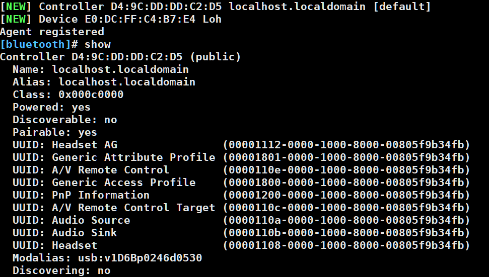

# Ubuntu 蓝牙连接命令
1. 安装 Bluetoothctl ：`sudo apt install bluez`
2. 查看蓝牙状态：`systemctl status bluetooth`
3. 启动交互式蓝牙连接：`bluetoothctl`
4. 查看蓝牙设备信息:`show`

4. 设置被其他设备发现
~~~shell
bluetoothctl discoverable on
~~~

5. 扫描设备
~~~shell
bluetoothctl scan on
~~~

6. 主动配对设备
~~~shell
bluetoothctl pair <MAC address>
~~~

7. 主动连接设备
~~~shell
bluetoothctl connect <MAC address>
~~~

8. 查看已配对设备
~~~shell
bluetoothctl paired-devices
~~~

9. 查看连接过的设备
~~~shell
bluetoothctl devices
~~~

10. 选择信任某些设备，方便以后与它们连接
~~~shell
bluetoothctl trust <MAC address>
# 取消信任
bluetoothctl untrust <MAC address>
~~~

11. 断开连接
~~~shell
bluetoothctl disconnect <MAC address>
~~~

---

 

---
## Link
- [wireless/bluetooth – Gateworks](http://trac.gateworks.com/wiki/wireless/bluetooth)
- [BlueZ调试工具的使用_Dokin丶的博客-CSDN博客_bluez](https://blog.csdn.net/qq_27575841/article/details/123887783)

